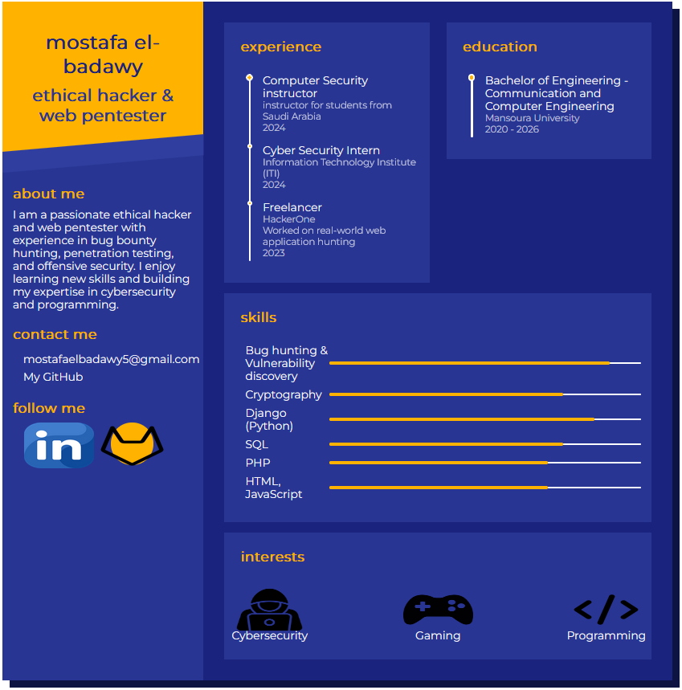

# Mostafa El-Badawy's Portfolio

Welcome to my personal portfolio website built with Django! This project showcases my skills, education, experience, and interests as I continue to learn and grow in web development, ethical hacking, and cybersecurity.
Overview

This portfolio is a web-based resume built using Django as the backend framework. The project demonstrates my knowledge of Django, HTML, CSS, JavaScript, and some basic integrations. It is a work-in-progress that I am using as a learning tool to continue improving my development skills.
Features

    Responsive Design: The portfolio adjusts to different screen sizes.
    Portfolio Sections:
        About Me: A brief introduction to who I am.
        Contact Information: Links to my email and GitHub profile.
        Experience & Education: Details of my career and academic background.
        Skills: Displays my proficiency in areas like cybersecurity, penetration testing, and web development.
        Interests: Personal interests such as gaming and programming.
    Social Media Links: Quick access to my LinkedIn and GitHub profiles.

Project Structure

    static/: Contains CSS, JavaScript, and image files.
    templates/: Includes the main HTML template used for rendering the portfolio.
    portfolio/: App that handles the main content and logic of the portfolio page.

Setup
Prerequisites

To run this project locally, you need to have the following installed:

    Python 3.x
    Django

Technologies Used

    Django: Backend framework
    HTML/CSS: For designing the structure and style of the website
    JavaScript (jQuery): For interactive elements and animations
    FontAwesome: For icons
Future Improvements

As I continue learning Django and web development, I plan to add the following features:

    Authentication: Allow users to log in and update their portfolios.
    Database Integration: Store and manage user data dynamically.
    Form Validation: Add forms for contact and feedback.
    Deployment: Host the project on a platform like Heroku or DigitalOcean.

Contact Me

    Email: mostafaelbadawy5@gmail.com
    GitHub: github.com/mostafa587
    LinkedIn: linkedin.com/in/mostafa-elbadawy-291583250
